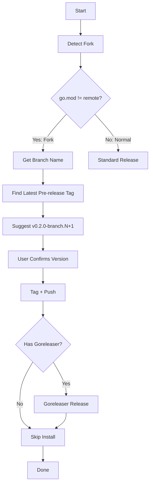

# Fork Release

When working with forked Go projects, task-plus supports pre-release versioning to distinguish fork builds from upstream releases.

## Flowchart



## How It Works

### Fork Detection

task-plus compares the `module` path in `go.mod` with the git remote origin URL. If they differ, the project is a fork. For example:

- `go.mod`: `module github.com/nicholasgasior/gsfm`
- Remote: `github.com/drummonds/gsfm`

This mismatch triggers fork mode automatically.

### Pre-release Versioning

Fork releases use semver pre-release suffixes: `vX.Y.Z-branch.N`

- **branch** — current git branch name
- **N** — auto-incremented iteration number

Example sequence:
```
v0.2.0-main.1
v0.2.0-main.2
v0.2.0-main.3
```

The base version (`v0.2.0`) tracks the upstream version you're building against.

### Overriding Detection

Set `fork: true` or `fork: false` in `task-plus.yml` to override auto-detection:

```yaml
fork: true
```

This is useful when `go.mod` has already been updated to the fork path (so auto-detection wouldn't trigger).

### Install Behaviour

Fork releases skip `go install` since the module path won't resolve correctly via the Go proxy. Install manually if needed.
