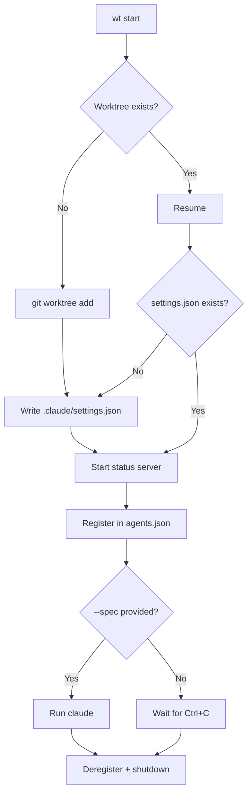

# Worktrees for Claude Development

task-plus manages git worktrees so you can run multiple Claude agents in parallel, each in its own isolated branch.

## Quick Start

```bash
# One-off: generate Taskfile snippets
task-plus wt --init

# Start a worktree with a Claude task
task-plus wt start --task=add-login --spec="implement the login page"

# Or without --spec to get an agent that waits for Ctrl+C
task-plus wt start --task=add-login

# Monitor all running agents
task-plus wt dashboard          # web UI (default)
task-plus wt dashboard --term   # terminal table
```

## How It Works



## Commands

| Command | Description |
|---------|-------------|
| `wt start --task=NAME [--spec="PROMPT"]` | Create or resume a worktree, optionally run Claude |
| `wt review --task=NAME` | Show diff between main and the task branch |
| `wt merge --task=NAME` | Merge task branch into current branch, remove worktree |
| `wt clean --task=NAME` | Force-remove worktree and delete branch |
| `wt list` | List all git worktrees |
| `wt dashboard [--term]` | Live dashboard of running agents |
| `wt --init` | Print Taskfile.yml snippets for all wt commands |

## Agent Lifecycle

Each `wt start` registers itself in `~/.config/task-plus/agents.json` with:
- HTTP port (random, serves `/status`)
- PID, worktree path, branch, project name, start time

On exit (normal or Ctrl+C), the agent:
1. Shuts down the HTTP status server
2. Deregisters from agents.json

Stale entries (dead PIDs) are cleaned automatically on every `wt start`.

## Resume Support

If you run `wt start --task=add-login` and the worktree directory already exists, it resumes instead of failing with "branch already exists". This handles:
- Machine reboots
- Interrupted sessions
- Re-running a task after reviewing changes

## Dashboard

The dashboard polls each registered agent's `/status` endpoint every 2 seconds.

**Web mode** (default, port 8091): Bulma-styled table with auto-refresh, powered by lofigui.

**Terminal mode** (`--term`): ANSI table that clears and redraws. Ctrl+C exits.

Both modes show: task key, branch, status (Running/Idle/Offline), last commit subject, uptime, and port.

## Directory Layout

Worktrees are placed alongside the main repo:

```
~/projects/
  my-app/              # main repo
  my-app-add-login/    # worktree for task "add-login"
  my-app-fix-bug/      # worktree for task "fix-bug"
```

Each worktree gets a `.claude/settings.json` with sandbox config (denies `~/.ssh` and `~/.aws` reads). Sandbox stub files are excluded via `.git/info/exclude`.

## Taskfile Integration

Run `task-plus wt --init` to get copy-paste Taskfile snippets:

```bash
task wt:start TASK=my-feature SPEC="implement the login page"
task wt:review TASK=my-feature
task wt:merge TASK=my-feature
task wt:clean TASK=my-feature
task wt:list
task wt:dashboard
```
